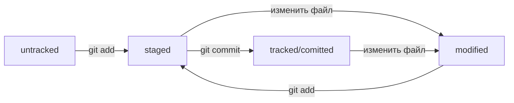

git - самая популярная система контроля версий.

## Конфигурация git

Просмотреть текущую конфигурацию git можно одной из команд:
```bash
$ cat ~/.gitconfig
$ git config --list 
```
Изменить имя и почту можно следующими командами:
```bash
$ git config --global user.name "ваше имя или ник латиницей" 
$ git config --global user.email ваша электронная почта 
```

## Инициализация репозитория

Сделать папку репозиторием можно командой `git init`.

Если нужно "разобрать" репозиторий и сделать папку "обычной", то нужно удалить .git (`rm -rf .git`).

## Добавление файлов в репозиторий

`git add` добавляет файлы к коммиту  
- `git add .` добавит все файлы **текущей** дериктории.
- `git add example.txt` добавит только указанный файл.
- `git add -all` добавит все файлы репозитория.

`git commit` выполнит непосредственно коммит всех файлов, добавленных с помощью git add.  
Чтобы добавить комментарий при коммите, необходимо использовать ключ -m. Например,  
`git commit -m ‘Комментарий для понимания содержания коммита’`

## История коммитов

Проверить историю коммитов можно командой `git log`.  
Будут выведены хэши коммитов, автор (имя и почта), дата коммита и комментарий коммита.

`git log --oneline` выведет сокращенный лог. Одна строка - один коммит. В стоке содержится сокращенный хэш (несколько первых символов, достаточных для идентификации коммита) и комментарий.

HEAD указывает на самый новый коммит в репозитории.

## Проверка состояния репозитория 

Каждый файл репозитория помечается одним из статусов:
- `untracked` - git «видит», что такой файл существует, но не следит за изменениями в нём. У untracked-файла нет предыдущих версий, зафиксированных в коммитах или через команду `git add`.
- `staged` - файл добавлен в staging area с помощью `git add`. Staging area также называют index или cache, а состояние файла `staged` иногда называют `indexed` или `cached`.
- `tracked` - это противоположность untracked. Оно довольно широкое по смыслу: в него попадают файлы, которые уже были зафиксированы с помощью git commit, а также файлы, которые были добавлены в staging area командой git add. То есть все файлы, в которых Git так или иначе отслеживает изменения.
- `modified` означает, что Git сравнил содержимое файла с последней сохранённой версией и нашёл отличия. Например, файл был закоммичен и после этого изменён.

Команда git add добавляет в staging area только текущее содержимое файла. Если вы, например, сделаете git add file.txt, а затем измените file.txt, то новое содержимое файла не будет находиться в staging.

Git сообщит об этом с помощью статуса modified: файл изменён относительно той версии, которая уже в staging. Чтобы добавить в staging последнюю версию, нужно выполнить git add file.txt ещё раз.

`git status` выводит все состояния, кроме `tracked`.

Схема состояний и переходов для файлов:



## Внесение изменений в коммиты

`git commit --amend --no-edit` - дополнит файлы из staging area к новому коммиту. Хэш последнего коммита изменится. --no-edit значит, что комментарий не изменится.  
`git commit --amend -m "Новое сообщение"` - изменит комментарий последнего коммита.

`git restore --staged <file>` - убрать файл из staging area (перевести из статуса staged в untracked/modified.  
`git restore --staged .` - уберет из staging area всю текущую директорию.  
`git restore <file>` - восстановит состояние файлов, которое было зафиксировано последней командой git commit или git add.

`git reset --hard <commit hash>` - переносит HEAD к указанному коммиту. Теперь разработка будет вестись от него. Коммиты, которые были между старым HEAD и новым HEAD удаляются.

## Просмотр измененных файлов

`git diff` покажет изменения в статусе modified  
`git diff --staged` покажет изменения в статусе staged  
`git diff 1c29af6 48fe3dc` - покажет разницу между коммитами  
`git diff 1c29af6 HEAD` - покажет разницу между коммитом 1c29af6 и последним коммитом

## Игнорирование файлов в Git

Чтобы не хранить историю изменений для каких-то файлов, необходимо создеть файл `.gitignore`.  
Правила из `.gitignore` применяются только к новым (untracked) файлам. Если файл уже попал в staging area или в коммит, то правила на него не распространяются.

Формат записи:
- Указать название файла. Например, `credentials`. Будут игнорироваться файлы с таким названием во всех директориях.
- Указать шаблон наименований файлов (регулярными выражениями). Например, `*.jpeg`, `doc/*/tmp`, `doc/**/tmp`, `file?.txt`, `file[0-2].txt`. Разница между `doc/*/tmp` и `doc/**/tmp`: в первом варианте может быть только одна любая дирекория между doc и tmp, во втором - сколько угодно директорий между doc и tmp.
- Указать, что нужно игнорировать файл только в конкретной директории. Например, `/test.txt`.
- Указать название директории для игноирования. Например, `build/`.
- Указать название файла, который не нужно исключать. Например, `!hello.jpeg`.

Пример .gitignore:
```
# игнорировать все файлы в каталоге build
build/

# игнорировать все .log файлы
*.log

# не игнорировать *.log файлы в examples
# потому что это пример для документации
!examples/**/*.log
```
Другой пример:
```
# игнорировать все файлы
**

# кроме .tex и .pdf
!**.tex
!**.pdf 
```

## Ветки

`git branch` позволяет просмотреть список локальных веток для текущего репозитория.  
Звёздочкой помечается текущая ветка.  
`git branch -a` позволяет просмотреть список всех веток (и локальных, и удаленных).  
`git branch feature/add-branch-info` - создать ветку с названием `feature/add-branch-info`.  
`git checkout <название_ветки>` - переключиться на указанную ветку.  
`git checkout -b <название_ветки>` - создать ветку и сразу переключиться на неё.  

`git diff master feature/diff` - посмотреть разницу между ветками.  
`git diff main 2ea56ab` - посмотреть разницу между текущей веткой и конкретным коммитом.  
Также с веткой можно сравнивать указатель HEAD.  

Чтобы вывести разницу между предыдущим и текущим коммитами, выполнить следующую команду:
```
git diff HEAD~ HEAD`  
```
Или то же самое, но через ~N.  
```
git diff feature/diff~1 feature/diff 
```
Или можно использовать хеши.  
```
git diff 2ea56ab~ 2ea56ab 
```

`git merge <название_ветки>` выполнить слияние ветки.  
`git branch -D название-ветки` удалить ветку после слияния.  
`git branch -d название-ветки` более безопасное удаление. Удалит ветку только если она была полностью объединена с другой — то есть если две ветки стали (или изначально были) частью одной истории.  

`git remote add origin git@github.com:%ИМЯ_АККАУНТА%/git-branches.git` связать внешний и локальный репозиторий.  
`git push -u origin main` связывает снешнюю и локальную ветку.  
`git push -u origin feature/merge-request` перенести локальную ветку на удаленный репозиторий. Выведется ссылка на создание pull request, но PR можно создать и из интерфейса guthub.  

```
$ git checkout main # перешли в main
$ git pull # подтянули новые изменения в main
$ git checkout my-branch # вернулись в рабочую ветку my-branch
$ git merge main # влили main в новую ветку my-branch
$ git push -u origin my-branch # отправили ветку my-branch в удалённый репозиторий 
```

`git remote rm origin` удалить текущий привязанный origin.  

